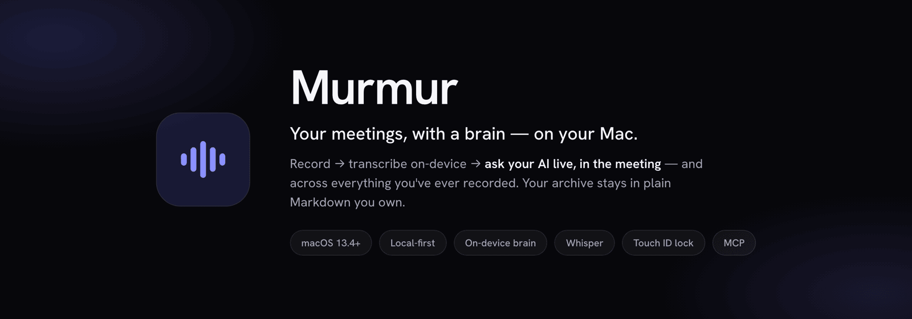
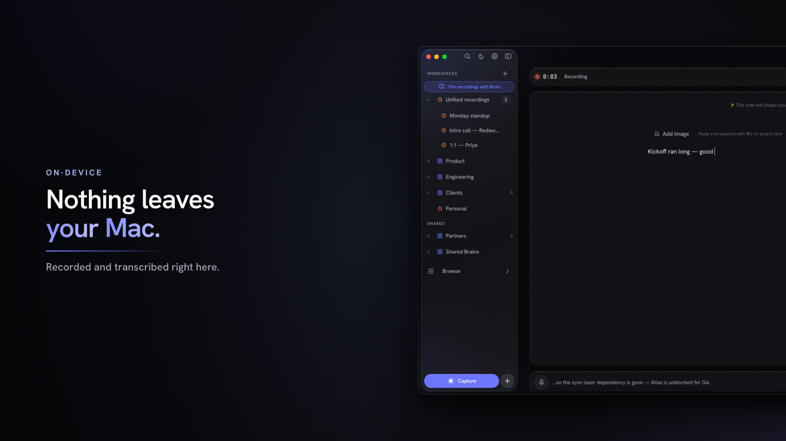
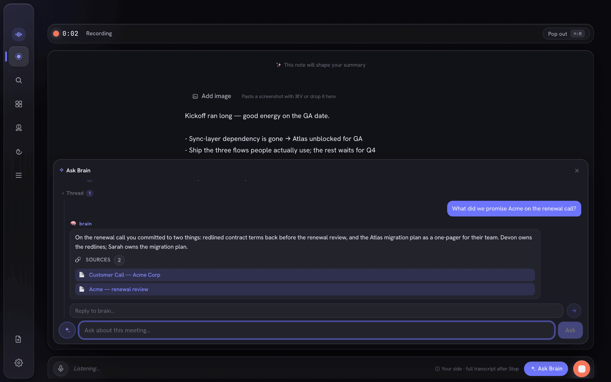
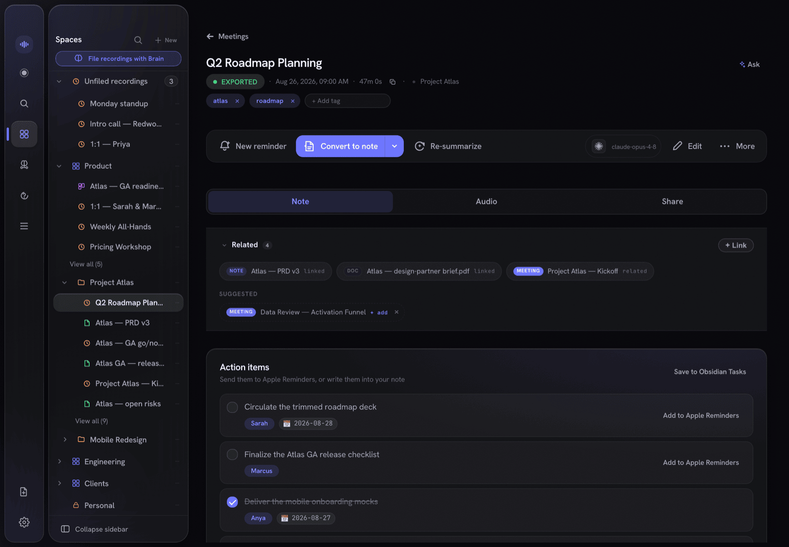
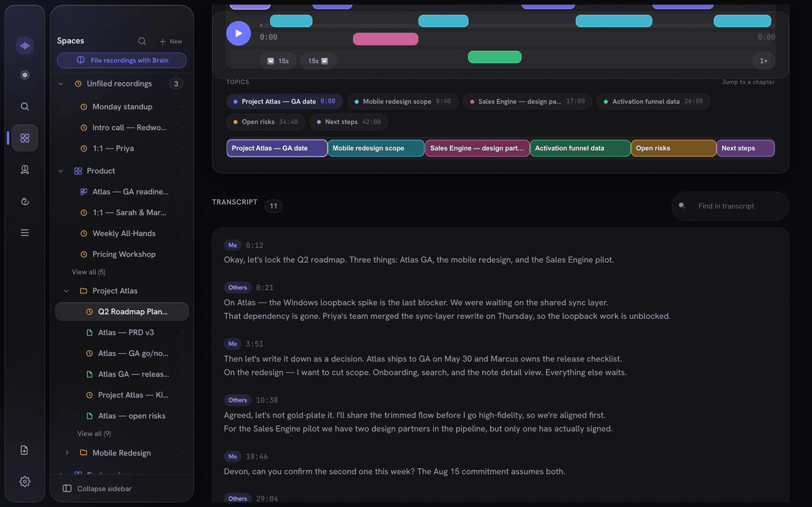
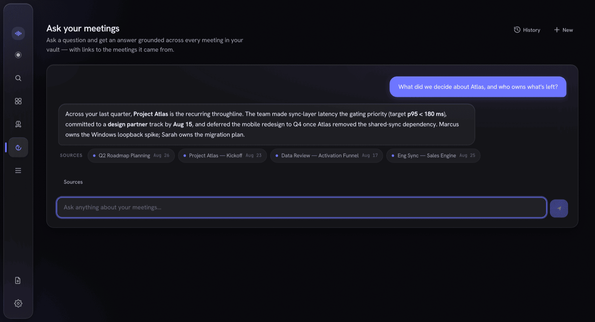
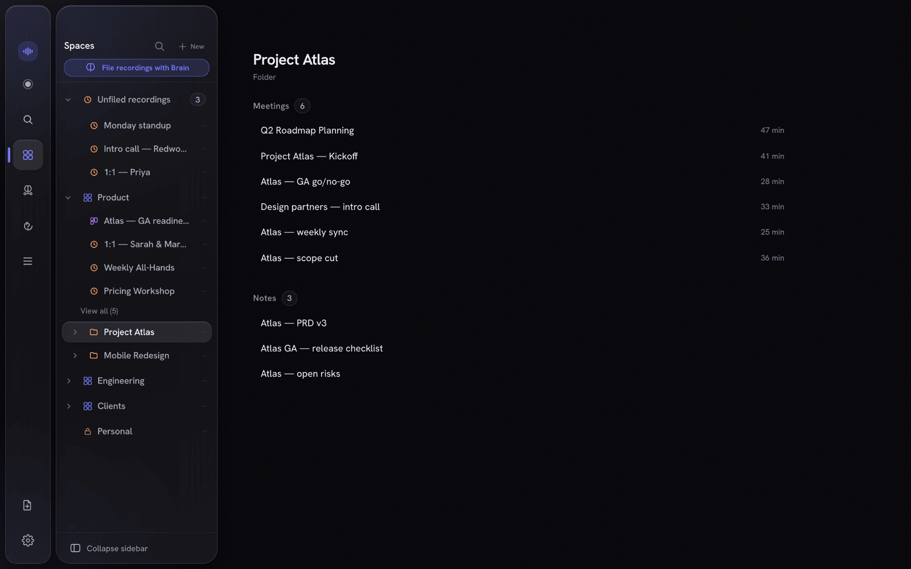
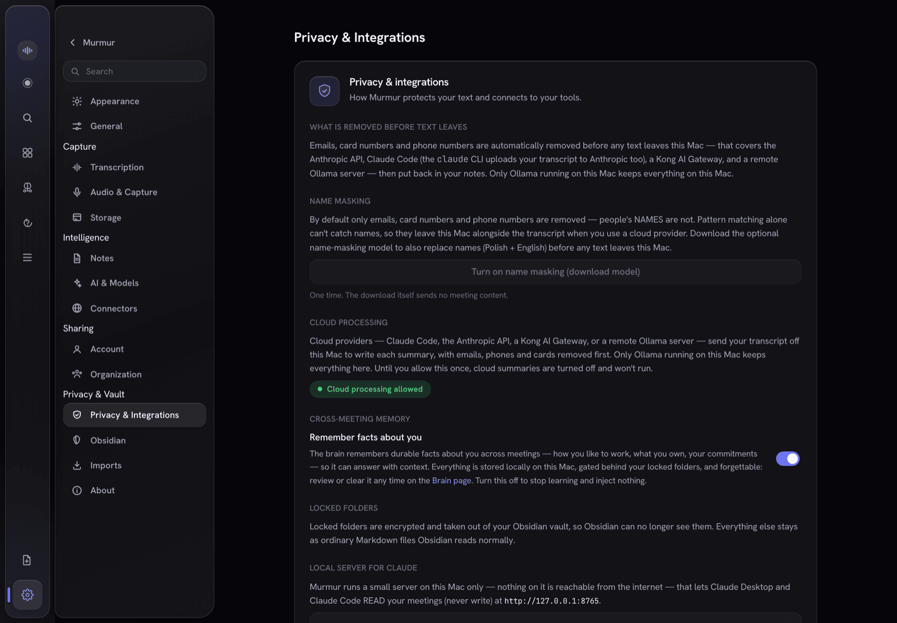

<p align="center">
  
</p>

<h1 align="center">Murmur</h1>

<p align="center">
  <b>Local-first meeting notes for macOS.</b><br/>
  Murmur records your calls, transcribes them <i>on your Mac</i>, writes a structured note you own as plain Markdown,<br/>
  and lets you ask questions — during the meeting and across everything you have ever recorded.
</p>

<p align="center">
  <a href="https://github.com/murmur-io/murmur-notes/releases/latest"></a>
  
  
  
</p>

<p align="center">
  <a href="https://github.com/murmur-io/murmur-notes/releases/latest"><b>Download for macOS</b></a> ·
  <a href="https://murmurnotes.io"><b>murmurnotes.io</b></a> ·
  <a href="https://murmurnotes.io/docs.html"><b>Documentation</b></a> ·
  <a href="https://github.com/murmur-io/murmur-notes/releases"><b>Release notes</b></a> ·
  <a href="#support-and-feedback"><b>Support</b></a>
</p>

<p align="center">
  <a href="https://murmurnotes.io/#product"></a>
  <br/><a href="https://murmurnotes.io/#product">Watch the 90-second tour</a>
</p>

---

## Contents

- [What this repository is](#what-this-repository-is)
- [What Murmur is](#what-murmur-is)
- [Screenshots](#screenshots)
- [Features](#features)
- [Download and install](#download-and-install)
- [First run and macOS permissions](#first-run-and-macos-permissions)
- [Updating](#updating)
- [Privacy and security](#privacy-and-security)
- [Obsidian, MCP and your own agent](#obsidian-mcp-and-your-own-agent)
- [Where your data lives](#where-your-data-lives)
- [Uninstall](#uninstall)
- [FAQ](#faq)
- [Support and feedback](#support-and-feedback)
- [Reporting a security issue](#reporting-a-security-issue)
- [Authors](#authors)
- [License](#license)

## What this repository is

This is Murmur's public home. It holds:

- **the downloads** — the signed, notarized DMG of every Murmur release from 2.0 on is attached to a
  [release](https://github.com/murmur-io/murmur-notes/releases),
  together with its release notes (the same text is kept in [`release-notes/`](release-notes/));
- **the website** — [`site/`](site/) is what [murmurnotes.io](https://murmurnotes.io) serves;
- **the documentation** — the [user docs](https://murmurnotes.io/docs.html), the
  [guide for using Murmur with your own AI agent](docs/use-with-your-agent.md) and the
  [skill pack](vault-skills/README.md) for Claude Code;
- **the issue tracker and Discussions** for bug reports, ideas and questions.

The source code of the Murmur app is not public, and it is not in this repository.

## What Murmur is

Murmur is a desktop app for macOS that turns your meetings into memory you can search and ask
questions of.

1. **Record.** Press Record (or `⌘⇧R` from any app). Murmur captures your microphone and the other
   side's audio as two separate streams.
2. **Transcribe.** Both streams are transcribed on your Mac with Whisper and merged into one
   **Me / Others** transcript. There is no cloud transcription.
3. **Write the note.** When you stop, an AI of your choice writes a structured note — summary,
   decisions, action items, quotes — with links from each grounded line back to the second of audio
   it came from.
4. **Ask.** Mid-meeting or months later, ask a question and get an answer with the meetings and
   notes it was drawn from.

Everything lives in one encrypted database on your Mac. You read it in the app, in your
[Obsidian](https://obsidian.md) vault as plain `.md` files, or from AI tools through a local,
read-only MCP server.

Murmur is **free during early access**. Local recording, transcription, notes and exports need no
account and no payment.

## Screenshots

| | |
| --- | --- |
|  |  |
| **Record** — take notes alongside a live recording and ask the assistant mid-call. | **The note** — summary, decisions, action items and quotes, written when you stop. |
|  |  |
| **Transcript** — your mic and the other side, merged into Me / Others. | **Ask** — questions across every meeting and note, answered with sources. |
|  |  |
| **Workspaces** — recordings, notes, tasks and boards in one tree. | **Privacy** — see and control what, if anything, leaves your Mac. |

Screenshots show the real app rendered over a demo dataset; no real meetings are pictured.

## Features

### Capture and transcription
- **Both sides of the call.** Your microphone and the other participants' audio are recorded as two
  streams, transcribed independently and merged by wall-clock time into a Me / Others transcript.
  System audio uses a Core Audio process tap on macOS 14.4 and later, and a ScreenCaptureKit helper
  on macOS 13.4–14.3.
- **On-device Whisper** (whisper.cpp with Metal). Pick a model yourself, or pick a level: Light
  (~150 MB), Balanced (~470 MB), Sharp (~875 MB) or Maximum (~3 GB). Murmur suggests a default for
  your Mac's chip and memory.
- **Live captions** while you talk. The saved transcript is always Whisper's.
- **Crash-safe.** Audio is written to disk as you record, so a crash or power cut still leaves a real
  transcript. A single recording can run up to four hours.
- **A floating recorder bar**, reachable from any app with `⌘⇧R`.

### Notes, answers and receipts
- **Structured notes** after every call: summary, decisions, action items, quotes.
- **Receipts.** Lines grounded in what was said carry a chip that jumps to that moment in the audio,
  with the speaker.
- **Ask during the meeting** without stopping the recording, or **ask across everything** afterwards.
  Narrow a question to one Workspace or folder. Every answer lists its sources.
- **Hybrid search** — keyword, semantic and an automatically built graph of people and projects.
- **A full Markdown editor** for notes you write yourself, with a selection menu to refine, shorten,
  translate or fact-check against your own meetings.
- **Documents too.** Add PDFs (scanned pages go through on-device OCR), Word, PowerPoint, Excel, web
  pages, Markdown and images; they become searchable next to your meetings.
- **Tasks and reminders** proposed from your meetings — you accept them — with optional push to Apple
  Reminders.

### Organizing
- **Workspaces** — one tree for recordings, notes, tasks and boards.
- **Dashboards** — compose boards from notes, recordings, documents, people and reminders, and pin
  answers that you can re-run.
- **Imports** — bring in a Notion export, an Obsidian vault or Apple Notes, fully offline, with a dry
  run first that shows what would be imported.
- **Trash** keeps deleted items for 30 days by default (configurable from 1 day to a year).

### Choose where the AI runs

One setting decides which AI writes your notes and answers your questions, and you can override it
per feature. Murmur offers six connections:

| Connection | Where it runs | Does meeting text leave your Mac? |
| --- | --- | --- |
| **Murmur Brain, on-device** (Qwen3 1.7B / 4B / 14B or Bielik 1.5B / 4.5B / 11B, downloaded once) | Your Mac | No |
| **Ollama** at a local address | Your Mac | No |
| **Claude Code** (the default note writer) — the `claude` CLI | Local CLI → Anthropic | Only after you consent; redacted first |
| **Codex** — OpenAI's CLI | Local CLI → OpenAI | Only after you consent; redacted first |
| **Anthropic API** with your own key (stored in the macOS Keychain) | Direct HTTPS | Only after you consent; redacted first |
| **Kong AI Gateway**, or another OpenAI-compatible endpoint you point it at | Direct HTTPS | Only after you consent; redacted first |

An Ollama server at a non-local address is treated as cloud: it needs consent and passes the
redaction firewall.

### Sharing (optional, end-to-end encrypted)
- **Shared Brain** — publish a note or meeting summary to your organization; it stays in sync as you
  edit. Content is sealed with AES-256-GCM on your Mac before upload; the relay stores only
  ciphertext, wrapped keys and public keys.
- **Per-document permissions** (View only / Can edit), more than one organization, and shared tasks.
- **Encrypted share links** with an expiry, an optional password and a limit on how many times they
  can be opened.
- Sharing needs a free account. Your password never leaves the Mac: sign-in uses the OPAQUE protocol.

### Integrations
- **Obsidian** — atomic Markdown export with YAML front-matter, `[[wikilinks]]`, `obsidian://`
  block references and an optional `.canvas` board.
- **Local MCP server** — 20 read-only tools for Claude Desktop, Claude Code and other MCP clients.
- **Optional live connectors** — Slack, Notion, ClickUp, Jira, web search and your own MCP servers.
  Each is off until you enable and consent to it; outgoing queries pass the redaction firewall.
- **Calendar** — your upcoming events, read on the Mac, for pre-meeting briefs.

## Download and install

**Requirements**

| | |
| --- | --- |
| macOS | **13.4 (Ventura) or later**. System-audio capture uses a Core Audio tap on 14.4+ and ScreenCaptureKit on 13.4–14.3. |
| Mac | **Apple Silicon or Intel** — one universal app. On-device AI is fastest on Apple Silicon. |
| Disk | About 90 MB for the download, plus the models you choose: Whisper 150 MB – 3 GB; the optional on-device AI model 1.1 – 9.7 GB. |

**Install**

1. Download `Murmur-<version>.dmg` from the
   [latest release](https://github.com/murmur-io/murmur-notes/releases/latest).
2. Open the DMG and drag **Murmur** into **Applications**.
3. Open Murmur from Applications. Because it came from the internet, macOS asks once whether you want
   to open it — choose **Open**.

Every release is signed with an Apple Developer ID and **notarized by Apple**, with the notarization
ticket stapled to the DMG. macOS checks both before the app runs.

If macOS says Murmur "cannot be opened" or "is damaged", do not work around it — delete the file,
download it again from the release page above, and [open an issue](https://github.com/murmur-io/murmur-notes/issues/new/choose)
if it happens again.

**Verify a download (optional)**

```bash
# Gatekeeper assessment of the DMG — expect "accepted" and "source=Notarized Developer ID"
spctl -a -vvv -t open --context context:primary-signature ~/Downloads/Murmur-<version>.dmg

# The notarization ticket is stapled to the DMG
xcrun stapler validate ~/Downloads/Murmur-<version>.dmg

# After installing: the app's signature
codesign -dv --verbose=2 /Applications/Murmur.app 2>&1 | grep -E "Authority|TeamIdentifier"
#   TeamIdentifier should read BVF778E5QD
```

Each release also carries a `SHA256SUMS.txt` file; `shasum -a 256 -c SHA256SUMS.txt` in the
download folder checks the DMG against it.

## First run and macOS permissions

A short setup wizard walks you through:

1. **Transcription model** — Murmur downloads a Whisper model once.
2. **AI for notes** — Claude Code, Codex, Anthropic API, Ollama or Kong AI Gateway.
3. **On-device model** — optional; download one to keep notes and answers entirely on the Mac.
4. **Vault folder** — optional; a folder (for example your Obsidian vault) where notes are written as
   Markdown.

macOS asks for each permission the first time Murmur needs it — not all at once:

| Permission (System Settings → Privacy & Security) | Why | When it is asked |
| --- | --- | --- |
| **Microphone** | Record your side of the call | First recording |
| **Screen & System Audio Recording** (on macOS 14.4+ this may appear as system audio recording only) | Record the other participants' audio playing on your Mac. Murmur saves audio only — it does not record your screen. | First recording |
| **Calendars** | Read upcoming events for pre-meeting briefs, on the Mac | When you turn on calendar context |
| **Reminders** | Add action items to Apple Reminders | When you first push an item |
| **Automation → Notes** | Read Apple Notes during an import | When you import from Apple Notes |
| **Touch ID / your login password** | Release the key that unlocks a locked Workspace or folder | When you unlock |

You can revoke any of these later in System Settings → Privacy & Security.

Next: [Your first recording](https://murmurnotes.io/docs.html#first-recording).

## Updating

- **Check on launch.** Murmur asks GitHub whether a newer release exists each time it starts. The
  request carries your Murmur version and nothing else. You can turn it off in
  **Settings → Privacy & Integrations → Check for updates on launch**.
- **Check now.** **Settings → About → Check for updates** always works, even with the launch check off.
- When a new version exists, Murmur shows a notice with a **Download** button that opens the release
  page. Murmur never downloads or installs anything by itself.
- To update, download the new DMG and drag Murmur into Applications, replacing the old copy. Your
  library, recordings and settings stay where they are.

> **On Murmur 2.8.0 or earlier?** Those versions look for updates in a place that is no longer
> public, so they report that they couldn't check. Download the latest release from
> [this page](https://github.com/murmur-io/murmur-notes/releases/latest) once. Murmur 2.9.0 and
> later check here by themselves.

What changed in each version is on the [Releases page](https://github.com/murmur-io/murmur-notes/releases).

## Privacy and security

**Local by default.** Recording, transcription, search and the on-device AI work with no network
connection. Your audio and transcripts are never uploaded for transcription: there is no cloud
transcription.

**What can leave your Mac, and when**

| What | When | Where it goes |
| --- | --- | --- |
| An update check — your Murmur version, no content, no account | At launch (can be turned off) and when you press Check for updates | `api.github.com` |
| Model downloads — nothing about you or your meetings | Only when you start a download | Hugging Face |
| **Redacted meeting text** | Only if you choose a cloud AI connection **and** give one-time consent | The provider you chose |
| Search queries from a live connector, redacted | Only for connectors you enabled and consented to | That service |
| **Encrypted** notes, summaries and tasks | Only when you share, with an account | The Murmur sharing relay (ciphertext only) |

**Cloud AI is opt-in, redacted and logged.** Out of the box, notes are written by Claude Code, which
sends text to Anthropic — so until you consent once, cloud summaries are turned off and won't run.
Before any text leaves, a redaction firewall replaces email addresses, card-like numbers and phone
numbers with placeholders and puts them back in the result. Download the optional name-masking model
(Settings → Privacy & Integrations) and people's names are replaced too. Every cloud call is
recorded in an egress log you can read in the app. To keep everything on the Mac, pick the on-device
model or a local Ollama.

**Encrypted at rest, in two layers.**
- The whole database is encrypted with SQLCipher; its key lives in the macOS Keychain.
- **Lock** any Workspace or folder: its notes, transcripts, timelines and audio are sealed with
  AES-256-GCM under a content key that only Touch ID (or your login password) releases. Before the
  plaintext is removed, Murmur proves the sealed copy decrypts back identically. Unlocking is per
  session and reversible.
- A locked folder shows nothing — in the app, search, the graph, the MCP server or the audio player —
  until you unlock it.
- **Screen-share aware.** By default, Murmur relocks sealed folders when it detects screen sharing.
  You can turn this off.

**Sharing is end-to-end encrypted.** Content is sealed on your Mac before upload. The relay stores
ciphertext, wrapped keys and public keys — never plaintext. Account sign-in uses OPAQUE, so the
server never learns your password.

**Logs don't carry content.** The app log holds stage names, counts, durations and errors — never
note text, transcripts, titles or keys. It is kept for seven days and capped at 16 MB. It can hold
file paths on your Mac, which include your macOS user name.

Details: [What never leaves your Mac](https://murmurnotes.io/docs.html#data-flow) ·
[The lock model](https://murmurnotes.io/docs.html#lock-model) ·
[Redaction firewall](https://murmurnotes.io/docs.html#redaction-firewall) ·
[Known limitations](https://murmurnotes.io/docs.html#known-limitations)

## Obsidian, MCP and your own agent

**Obsidian.** Choose a vault folder in the setup wizard or in Settings. Each note is written there as
plain Markdown — YAML front-matter, `[[wikilinks]]`, `obsidian://` block references, and an optional
`.canvas` board. The files are yours; edit them in Obsidian or anything else that reads Markdown.
The encrypted database stays the source of truth. Locking a folder removes its notes from the vault;
removing the lock writes them back.

**MCP.** Murmur runs a read-only [Model Context Protocol](https://modelcontextprotocol.io) server on
`127.0.0.1:8765`, reachable only from your own Mac and protected by a bearer token by default. It
follows the lock model: a locked meeting is invisible to it.

Its 20 tools cover meetings and transcripts (`search_meetings`, `search_transcript`, `get_meeting`,
`get_meeting_chapters`, `list_recent_meetings`), semantic search (`search_semantic`), documents
(`get_document`, `get_document_outline`), commitments and people (`get_open_commitments`,
`get_entity_dossier`, `list_entities`, `knowledge_diff`), your structure (`list_note_folders`,
`list_workspace_hierarchy`, `query_database`), boards (`list_dashboards`, `get_dashboard`), shared
tasks (`list_tasks`, `get_task`) and your organization's Shared Brain (`org_search`).

Example configuration — copy the real block, with your token already in it, from
**Settings → Privacy & Integrations → Local server for Claude → Copy config**:

```json
{
  "mcpServers": {
    "murmur": {
      "type": "http",
      "url": "http://127.0.0.1:8765",
      "headers": { "Authorization": "Bearer <your-token>" }
    }
  }
}
```

**Your own agent.** If you run Claude Code (or another agent) over your vault, read
[Use Murmur with your own AI agent](docs/use-with-your-agent.md) and install the
[skill pack](vault-skills/README.md): two plain `SKILL.md` files that teach the agent Murmur's note
conventions and every MCP tool.

## Where your data lives

| What | Where |
| --- | --- |
| Library (encrypted database) | `~/Library/Application Support/MeetNotes/meetnotes.sqlite` |
| Recordings | `~/Library/Application Support/MeetNotes/audio/` |
| Downloaded models | `~/Library/Application Support/MeetNotes/models/` |
| App log and diagnostics bundle | `~/Library/Application Support/MeetNotes/` |
| Encryption keys and API keys | macOS Keychain, items named `com.meetnotes.app` |
| Exported notes | The vault folder you chose |

That folder keeps the app's original name. Don't rename it — Murmur would start with an
empty library.

## Uninstall

1. Quit Murmur (menu-bar icon → Quit).
2. Move `/Applications/Murmur.app` to the Trash.

That removes the app and keeps your library. To remove your data as well:

3. Delete `~/Library/Application Support/MeetNotes/`. **This permanently deletes every recording,
   transcript and note stored in Murmur**, including locked folders. Markdown files in your vault are
   not affected.
4. Open **Keychain Access**, search for `com.meetnotes.app` and delete those items. Only do this after
   step 3 — without its key, the library can't be opened.
5. Optional: remove Murmur from System Settings → Privacy & Security (Microphone, Screen & System
   Audio Recording, Calendars, Reminders, Automation), or run `tccutil reset All com.meetnotes.app`
   in Terminal.

A sharing account is not deleted by uninstalling, and the app has no button for deleting one yet;
see [SUPPORT.md](SUPPORT.md#deleting-a-sharing-account).

## FAQ

**Is Murmur free?**
Yes, during early access. Local recording, transcription, notes and exports need no account and no
payment. Pricing beyond early access will be announced separately.

**Is Murmur open source?**
No. The app is free to download and use, but its source code is not public. Murmur 2.8.0 and
earlier were originally published under the GNU AGPL-3.0 while their source code was public; see
[License](#license).

**Is the source code here?**
No. This repository holds Murmur's downloads, website, documentation and release notes.

**Does my audio go to the cloud?**
No. Transcription always runs on your Mac. Only redacted text can leave, and only to a cloud AI you
chose and consented to.

**Do I need an internet connection?**
Once, to download a Whisper model. After that, recording, transcription, search and the on-device AI
work offline. Cloud AI connections, connectors and sharing need a connection.

**Do I need Claude Code?**
Only if you keep it as the note writer. You can pick Codex, the Anthropic API, Kong AI Gateway, a
local Ollama, or an on-device model instead.

**Which languages does it support?**
Whisper transcribes many languages. For on-device AI you can choose multilingual Qwen3 models or
Polish-native Bielik models.

**Why does macOS ask for Screen & System Audio Recording?**
That permission is how macOS lets an app hear other apps' audio — the other people on the call.
Murmur saves audio only.

**Does it work with headphones?**
Yes. The other side's audio is captured from the system, not from your speakers.

**Does it work on Intel Macs?**
Yes — the app is universal. Large on-device AI models run best on Apple Silicon.

**What happens if I lock a folder and lose access to Touch ID?**
Your login password can release the same key. See [The lock model](https://murmurnotes.io/docs.html#lock-model)
before locking anything you can't afford to lose.

**Where can I see what changed in a version?**
On the [Releases page](https://github.com/murmur-io/murmur-notes/releases) — every version has its own
release notes.

## Support and feedback

- **Read the docs first:** [murmurnotes.io/docs.html](https://murmurnotes.io/docs.html), especially
  [Known limitations](https://murmurnotes.io/docs.html#known-limitations).
- **Found a bug?** [Open a bug report](https://github.com/murmur-io/murmur-notes/issues/new?template=bug_report.yml).
  Include your Murmur version (Settings → About), macOS version, and whether your Mac is Apple Silicon
  or Intel.
- **Have an idea?** [Suggest a feature](https://github.com/murmur-io/murmur-notes/issues/new?template=feature_request.yml).
- **Question?** Ask in [Discussions](https://github.com/murmur-io/murmur-notes/discussions).

> **Issues and Discussions are public.** Never paste transcripts, notes, meeting titles, attendee
> names, audio, API keys or your MCP token. Screenshots should show no real content.
>
> **Do not attach the diagnostics bundle to an issue.** It contains no note text or transcripts, but
> it can contain file paths from your Mac, and those include your macOS user name. Describe the
> problem in the issue; if we need the bundle, we will ask for it privately.

More in [SUPPORT.md](SUPPORT.md).

## Reporting a security issue

Please **don't** open a public issue. Use GitHub's
[private vulnerability reporting](https://github.com/murmur-io/murmur-notes/security/advisories/new).
See [SECURITY.md](SECURITY.md).

## Authors

Murmur is made by:

| | |
| --- | --- |
| <a href="https://github.com/JakubGawr"></a> | **[@JakubGawr](https://github.com/JakubGawr)** |
| <a href="https://github.com/Lukas9315"></a> | **Lucas — [@Lukas9315](https://github.com/Lukas9315)** |

See also [AUTHORS.md](AUTHORS.md) and [CITATION.cff](CITATION.cff).

## License

- **Documentation and website text** in this repository — the Markdown files, the release notes and
  the text of the pages in `site/` — are licensed under [CC BY 4.0](LICENSE). Credit "the Murmur
  authors" and link to this repository.
- **Not covered by CC BY 4.0:** the Murmur app (the DMGs attached to the releases), the Murmur name
  and logo, the screenshots and the promo video. They are © 2026 the Murmur authors, all rights
  reserved. The app is free to download and use.
- **Fonts** in `site/assets/fonts/` are licensed under the SIL Open Font License 1.1; each family's
  licence file sits next to it.
- **Earlier releases.** Murmur 2.8.0 and earlier were originally published under the GNU AGPL-3.0
  while their source code was public. The notes of each of those releases say so.

This section describes the licensing; it is not legal advice.
